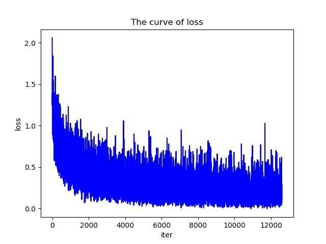
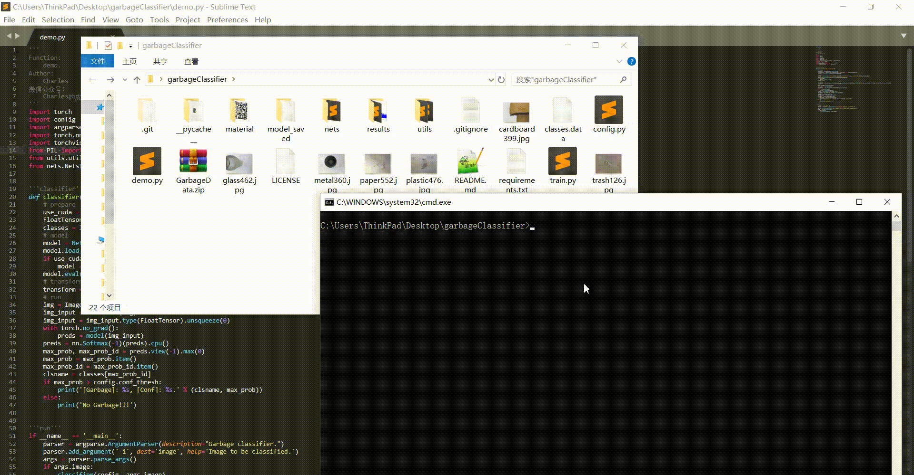

# garbageClassifier
```sh
garbage classifier, open an issues please if you have any problems.
You can star this repository to keep track of the project if it's helpful for you, thank you for your support.
```

# Introduction in Chinese
prepare

# Environment
- Ubuntu 16.04(train) / Windows10(test)
- python 3.5+(have installed the neccessary dependencies)
	- pytorch==0.4.1
	- torchvision==0.2.2
	- pillow
- Graphics: Tian XP(train) / 1050Ti(test)

# Train
#### Step1
```sh
Clone or download this repository and install the neccessary dependencies.
```
#### Step2
```sh
Unzip the dataset which is from https://www.kaggle.com/asdasdasasdas/garbage-classification/version/2.
for example:
run "unzip GarbageData.zip"
```
#### Step3
```sh
Modify the config.py according to your needs.
Explanations and defaut values of the hyperparameters:
	'''train and test'''
	net_name = 'resnet50' # support 'alexnet', 'vgg11', 'vgg11_bn', 'vgg13', 'vgg13_bn', 'vgg16', 'vgg16_bn', 'vgg19', 'vgg19_bn', 'resnet18', 'resnet34', 'resnet50', 'resnet101', 'resnet152', 'inception_v3'
	num_classes = 6 # num of classes
	traindata_dir = os.path.join(os.getcwd(), 'GarbageData/train') # the images dir for train
	testdata_dir = os.path.join(os.getcwd(), 'GarbageData/test') # the images dir for test
	learning_rate = 2e-4 # learning rate for adam
	load_pretrained = True # whether load the pretrained weights from https://download.pytorch.org/models/
	num_epochs = 200 # number of epochs while training
	batch_size = 32 # batch_size
	image_size = (224, 224) # image size for feeding network.
	save_interval = 10 # execute the operator of saving model weights every save_interval epochs
	save_dir = 'model_saved' # dir for save model
	logfile = 'train.log' # file to record train info
	gpus = '0,1' # gpu ids used
	ngpus = 2 # number of gpu used
	num_workers = 4 # number of worker used
	clsnamespath = 'classes.data' # save the class names
	'''for demo'''
	weightspath = 'model_saved/epoch_200.pkl' # model weight used
	conf_thresh = 0.5 # conf thresh
```
#### Step4
```sh
run "python train.py"
```

# Demo
```sh
Modify the config.py according to your needs.
run "python demo.py -i image_path"
```

# Results
#### train

#### test


# More
#### WeChat Official Accounts
*Charles_pikachu*  
